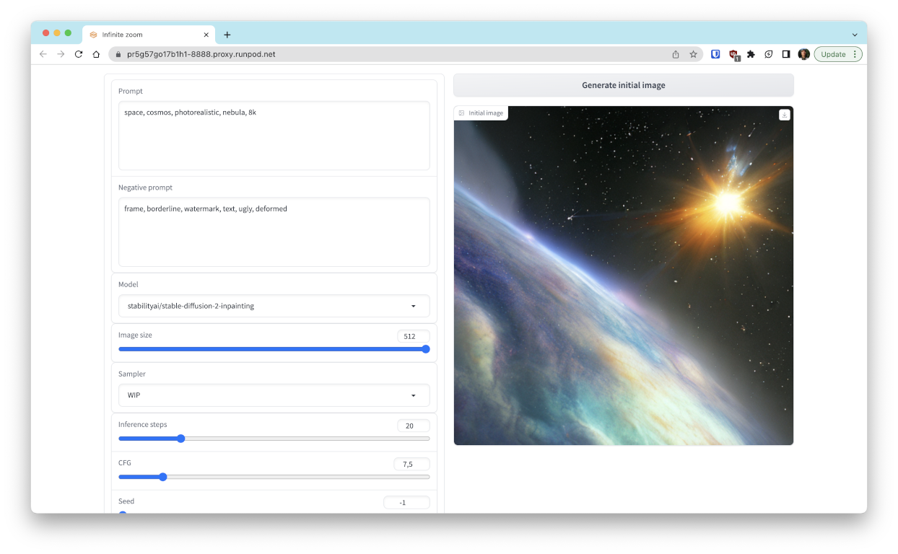
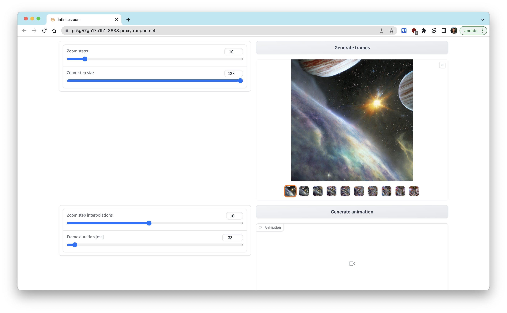
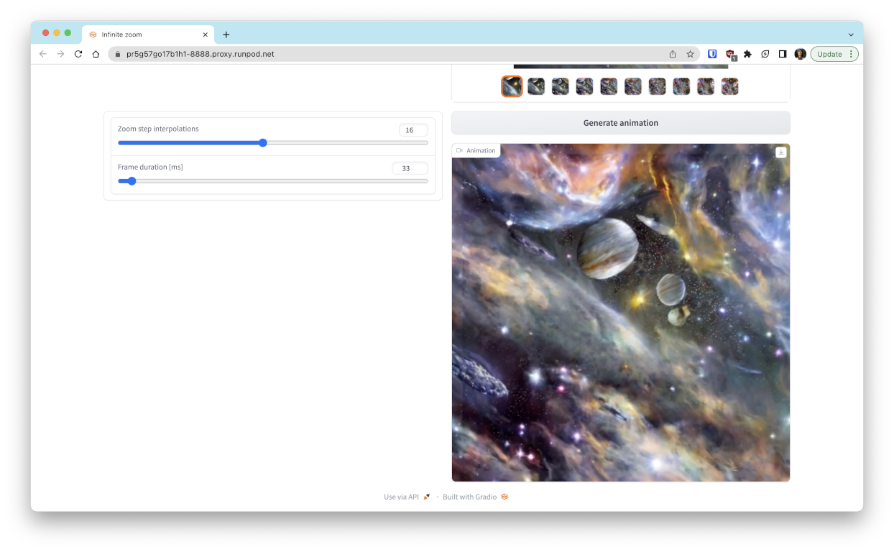

# Infinite zoom with Stable Diffusion

## Installation

Install this project using Poetry in the repository's root:

```shell
pip install poetry
poetry install
```

Install ffmpeg (macOS):

```shell
brew install ffmpeg
```

Install ffmpeg (Ubuntu):

```shell
apt install ffmpeg
```

## Running

```shell
poetry run python stable_diffusion/infinite_zoom/app.py
```






